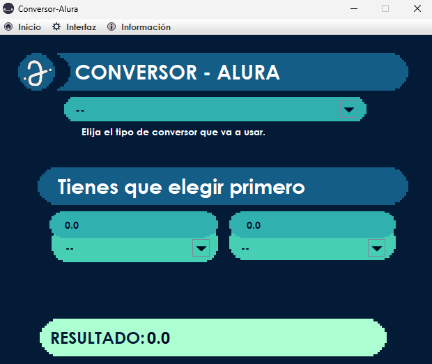

# CONVERSOR ALURA

[TOCM]

## Descripción de proyecto
Es un reto de programacion de ONE (Oracle Next Education), en una interfaz grafica debemos hacer una conversion de divisas con los datos ingresados por el usuario.

Requisitos:

- El convertidor de moneda debe:

      - Convertir de la moneda de tu país a Dólar
      - Convertir de la moneda de tu país  a Euros
      - Convertir de la moneda de tu país  a Libras Esterlinas
      - Convertir de la moneda de tu país  a Yen Japonés
      - Convertir de la moneda de tu país  a Won sul-coreano

- Recordando que también debe ser posible convertir inversamente, es decir:

       - Convertir de Dólar a la moneda de tu país
       - Convertir de Euros a la moneda de tu país
       - Convertir de Libras Esterlinas a la moneda de tu país
       - Convertir de Yen Japonés a la moneda de tu país
       - Convertir de Won sul-coreano a la moneda de tu país

Tambien colocar otro conversor como: Temperatura, velocidad, etc. Uno o los que quiera.

# Interfaz-Conversor

    

## Moneda
      <video width="640" height="360" controls>
      <source src="Videos/Moneda.mp4" type="video/mp4">
      </video>

Aqui inteiuhuih
